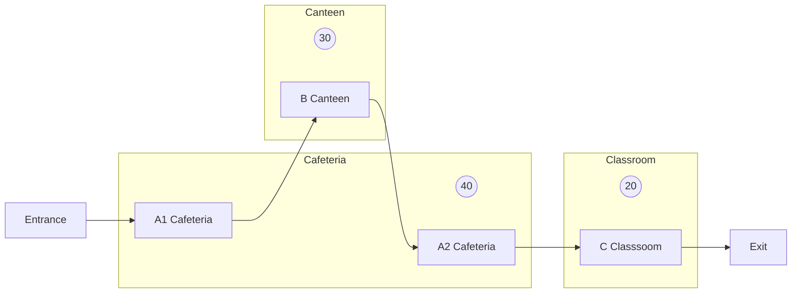

## **Systems Architecture**

# **Final Exam - December 20th 2023**

*Academic year 2021-2022*  
*Telematics Engineering Department - Universidad Carlos III de Madrid*

---

## General instructions
It is forbidden to use additional material on paper or other devices, the use of headphones, communication with other people, leaving the seat during the exam, and the use of additional software.

# Test
*3 points - 30min*

### Instructions
There is only one correct answer. Unanswered questions do not add or subtract, correct answers add 0.25
points and incorrect answers subtract 0.05 points.

Mark your answers here. Answers marked in the questionnaire will not be considered.
| 1 | 2 | 3 | 4 | 5 | 6 | 7 | 8 | 9 | 10 | 11 | 12 |
| - | - | - | - | - | - | - | - | - | -- | -- | -- |
|   |   |   |   |   |   |   |   |   |    |    |    |

## Test question 1
What is the output of the list after executing the following code?

```c
#include <stdio.h>
#include <stdlib.h>
struct node {
    int info;
    struct node* next;
};

void add(struct node *list, int info){
    struct node* newnode = (struct node*) malloc (sizeof(struct node));
    newnode->info = info;
    newnode->next = NULL;
    if(list == NULL){
        list = newnode;
    }
    else {
        newnode->next = list;
        list = newnode;
    }
}

void print_list(struct node* list){
    struct node* aux = list;
    while(aux!=NULL){
        printf("%d ",aux->info);
        aux = aux->next;
    }
    printf("\n");
}

int main(int argc, char **argv){
    struct node* list = NULL;
    add(list, 2);
    add(list, 3);
    print_list(list);
    return 0;
}
```

* a) 2 3
* b) 3 2
* c) 3 (2 is overwritten)
* d) The list is empty

## Test question 2
What is the output of Valgrind after executing this code?

```c
#include <stdio.h>
#include <stdlib.h>
#include <string.h>

int main(int argc, char **argv){
    char **array = (char **) malloc(sizeof(char *));
    array[0] = strdup("systems");
    char **aux = NULL;
    aux = (char **) realloc(array, 2*sizeof(char *));
    if(aux==NULL){
        exit(1);
    }
    array = aux;
    array[1] = strdup("architecture");
    printf("array[0]=%s , array[1]=%s\n", array[0], array[1]);
    free(array);
}
```

* a) 2 allocs, 1 frees
* b) 4 allocs, 1 frees
* c) 4 allocs, 2 frees
* d) 5 allocs, 3 frees

## Test question 3
What is the output of the following code? Asumme that the content of the file is “1234567890”

```c
#include <stdio.h>
#include <stdlib.h>

int main(){
    FILE *fd = fopen("q3file.txt", "r");
    fseek(fd, 2L, SEEK_SET);
    int val1 = fgetc(fd) - '0';
    rewind(fd);
    int val2 = fgetc(fd) - '0';
    fseek(fd, -3L, SEEK_END);
    int val3 = ftell(fd);
    int result = val1 + val2 + val3;
    printf("%d (%d+%d+%d)\n", result, val1, val2, val3);
    return 0;
}
```

* a) 10 (2+1+7)
* b) 11 (2+1+8)
* c) 11 (3+1+7)
* d) 12 (3+1+8)

## Test question 4
What happens after executing this code?

```c
#include <stdio.h>
#include <stdlib.h>
#include <sys/types.h>
#include <sys/wait.h>
#include <unistd.h>

void handler(int signal){
    kill(0,SIGQUIT);
}

int main(int argc, char **argv){
    pid_t child;
    child = fork();
    if(child<0){
        exit(EXIT_FAILURE);
    } else if(child==0){
    signal(SIGINT, SIG_IGN);    
    kill(0,SIGINT);
    } else {
        signal(SIGQUIT, handler);
        signal(SIGINT, handler);
        while(1);
    }
}
```

* a) The father kills the child and the child becomes a zombie.
* b) The father kills the child but the child does not become a zombie.
* c) The child kills the father and the child becomes orphan.
* d) The child kills the father and himself.

## Test question 5
What happens when executing these three command lines? Assume that the content q3file.txt of
is “1234567890” and the only content of the current directory at the beginning is q3file.txt

```bash
mkfifo q5fifo
cat q3file.txt > q5fifo.txt
cat q5fifo.txt | grep a
```

* a) The terminal is blocked after the second command and use of “echo q5fifo” in another terminal is needed
to finish the blockage.
* b) The terminal is blocked after the second command and use of “cat q5fifo” in another terminal is needed
to finish the blockage.
* c) The three lines are executed but the prompt goes to the next line without output.
* d) There is no blockage but the third command produces an error because it uses a
traditional pipe (|) instead of a fifo.

## Test question 6
Select the correct answer:

* a) There is only one way to implement the code in a well-defined problem.
* b) In a program, developers start designing small functions and then they reflect on how to aggregate them
to create higher-level function. That is an example of top-down approach.
* c) In the design of an ATM, we have this requirement: “the ATM must be able to read credit cards issues
by other banks”. This is an example of functional requirement.
* d) In the design of an ATM, we have this requirement: “the ATM must be able to performs withdrawals
so that users take 3 minutes at most”. This is an example of efficiency requirement.

## Test question 7
Select the correct answer:

* a) If you use several processes in a program, you cannot create threads in that program.
* b) Threads in Java can be created extending the interface Runnable.
* c) Class Thread is a non-abstract class in Java.
* d) start() method should be always overwritten to specify the actions of the thread

## Test question 8
You browse the lists of projects available in GitHub and you find an interesting project and you want to
make a copy so that you can work on it without affecting the original project. What would you do?

* a) git clone will be used
* b) git remote add will be used
* c) git pull will be used
* d) Fork will be used

## Test question 9
Which properties are fulfilled in the Peterson’s solution of the critical section?

* a) Mutual exclusion and bounded waiting
* b) Mutual exclusion and progress
* c) Mutual exclusion, progress and bounded waiting
* d) Progress and bonded waiting

## Test question 10
What is the output of this code?

```java
public class Q10 extends Thread {
    private Integer i;
    public static int counter;
    public Q10(Integer i) { this.i = i;}
    public void run() { synchronized(i) {counter++; System.out.println(counter);}}

    public static void main(String[] args) {
        Integer i = new Integer(5);
        Q10 q1 = new Q10(i);
        Q10 q2 = new Q10(i);
        q1.start();
    q2.start();
    }
}
```

* a) It always prints 1 1
* b) It usually prints 1 1 but a race condition can be produced, and a value of 1 2 can be printed
* c) It usually prints 1 2 but a race condition can be produced, and a value of 2 2 can be printed
* d) It always prints 1 2

## Test question 11
Considering the following solution of philosophers using semaphores, we can say

```java
import java.util.Random;
import java.util.concurrent.Semaphore;

public class Q11Phi extends Thread {
    private Semaphore a,b,c,d,e,f;
    public static int counter;
    private int id;
    private Random rd;
    public Q11Phi(Semaphore a, Semaphore b, Semaphore c, Semaphore d,
Semaphore e, Semaphore f) {
        this.a = a;
        this.b = b;
        this.c = c;
        this.d = d;
        this.e = e;
        this.f = f;
        id= ++counter;
        rd = new Random();
    }

    public void run() {
        if(id == 1) {
            while(true) {
                try {f.acquire();}catch(Exception e) {}


                try{a.acquire();}catch(Exception e) {}
                try{Thread.sleep(100);}catch(Exception e) {}
                try{b.acquire();}catch(Exception e) {}
                f.release();
                System.out.println("Thread 1 is executing");

    try{Thread.sleep(rd.nextInt(1000));}catch(Exception e) {}
                a.release();
                b.release();
            }
        } else if(id == 2){
            while(true) {
                try {f.acquire();}catch(Exception e) {}
                try{b.acquire();}catch(Exception e) {}
                try{Thread.sleep(100);}catch(Exception e) {}
                try{c.acquire();}catch(Exception e) {}
                f.release();
                System.out.println("Thread 2 is executing");

    try{Thread.sleep(rd.nextInt(1000));}catch(Exception e) {}
                b.release();
                c.release();
            }
        } else if(id == 3) {
            while(true) {
                try {f.acquire();}catch(Exception e) {}
                try{c.acquire();}catch(Exception e) {}
                try{Thread.sleep(100);}catch(Exception e) {}
                try{d.acquire();}catch(Exception e) {}
                f.release();
                System.out.println("Thread 3 is executing");

    try{Thread.sleep(rd.nextInt(1000));}catch(Exception e) {}
                c.release();
                d.release();
            }
        } else if(id == 4) {
            while(true) {
                try {f.acquire();}catch(Exception e) {}
                try{d.acquire();}catch(Exception e) {}
                try{Thread.sleep(100);}catch(Exception e) {}
                try{e.acquire();}catch(Exception e) {}
                f.release();
                System.out.println("Thread 4 is executing");

    try{Thread.sleep(rd.nextInt(1000));}catch(Exception e) {}
                d.release();
                e.release();
            }
        } else {
            while(true) {
                try {f.acquire();}catch(Exception e) {}
                try{e.acquire();}catch(Exception e) {}
                try{Thread.sleep(100);}catch(Exception e) {}
                try{a.acquire();}catch(Exception e) {}
                f.release();
                System.out.println("Thread 5 is executing");

    try{Thread.sleep(rd.nextInt(1000));}catch(Exception e) {}
                e.release();


                a.release();
            }
        }
    }
    public static void main(String[] args) {
        Semaphore a = new Semaphore(1);
        Semaphore b = new Semaphore(1);
        Semaphore c = new Semaphore(1);
        Semaphore d = new Semaphore(1);
        Semaphore e = new Semaphore(1);
        Semaphore f = new Semaphore(1,true);
        Q11Phi q1 = new Q11Phi(a,b,c,d,e,f);
        Q11Phi q2 = new Q11Phi(a,b,c,d,e,f);
        Q11Phi q3 = new Q11Phi(a,b,c,d,e,f);
        Q11Phi q4 = new Q11Phi(a,b,c,d,e,f);
        Q11Phi q5 = new Q11Phi(a,b,c,d,e,f);
        q1.start();
        q2.start();
        q3.start();
        q4.start();
        q5.start();
    }
}
```

* a) A deadlock is produced
* b) Starvation is produced because if you take both chopsticks at the same time, philosophers in the sides
can always be eating and you may never have the opportunity to eat
* c) The code works and starvation is not produced because the turn to take chopsticks is modelled using a
FIFO queue, so when it is the turn of a philosopher, he will have the opportunity to enter (maybe after
waiting some time).
* d) The code does not work because the initialization of semaphores is not correct (it should have 0 instead
of 1)

## Test question 12
Given this code, which uses a monitor:

```java
class MonitorQ12 {
    private int counter;
    public synchronized void increase() { counter++;
System.out.println(counter);}
}

public class Q12 extends Thread {
    private MonitorQ12 m;
    public Q12(MonitorQ12 m) { this.m=m;}
    public void run() {  
        m.increase();
    }

    public static void main(String[] args) {
        MonitorQ12 m = new MonitorQ12();
        Q12 q1 = new Q12(m);
        Q12 q2 = new Q12(m);
        q1.start();
        q2.start();
    }
}
```

* a) It always prints 1 1
* b) It is not a correct implementation of a monitor because increase() should be private
* c) It is not a correct implementation of a monitor because counter should be public
* d) It always prints 1 2

# PROBLEM 1 - C Problem
*3.5 points - 75min*

Madrid is trying to organize a Formula 1 GP. In his preparations of the GP, they need a software to control
the timing of the sessions and you have been asked to help organizers in that goal
Particularly, they want a multiprocessing program to insert the times of the drivers. The program will
have two processes and the behavior of each of them is as follows:

Parent process:

* Asks the user to insert from keyboard a string with the name of the driver and time. The string will have
the format “driver,time”, where driver is the initials of the driver (3 letters) and the time is the lap time
in seconds (e.g., SAI,61.756).
* Sends the information to the child through a pipe using a defined structure (TimeRecord, which can be
seen in the template of the code).
* Waits 200 ms after sending the information.
* Repeats the process indefinitely until the user presses CTRL-D

Child process:

* It has an infinite loop to wait for new information. In the loop, it first read the structure sent by the
parent.
* Afterwards, it adds the information in a linked list.
* Next, it prints the leaderboard (information in the linked list).
* When the user presses CTRL-D, it must also finish with EXIT_SUCCESS.

In order to solve the code, a template of the code has already been implemented for you:

```c
#include <stdio.h>
#include <stdlib.h>
#include <sys/types.h>
#include <sys/wait.h>
#include <unistd.h>
#include <signal.h>
#include <string.h>

struct time_record{
    char driver[4];
    double time;
    struct time_record *next;
} typedef TimeRecord;

void Print_list(TimeRecord *list){
    TimeRecord *aux = list;
    int pos = 1;
    while(aux != NULL){
        printf("%d: %s | %.3f\n", pos, aux->driver, aux->time);
        aux = aux->next;
        pos += 1;
    }
}

void Free_list(TimeRecord *list){
    TimeRecord *aux = list;
    while(aux != NULL){
        list = list->next;


        free(aux);
        aux = list;
    }
}

void Add(TimeRecord **list, TimeRecord *newtime){
    // SECTION 1.1
}

int main(int argc, char **argv){
    // SECTION 1.2
}
```

In this template, you are given the following structures and functions:

* TimeRecord: it is a structure to store the information. It stores the initial of the drivers and the time.
It also contains a pointer to the next element, so it is used to make a linked list.
* Print_List: it is a function to print the list. It is already implemented and finished.
* Free_list: it is a function to free all the memory involved in the linked list. It is already implemented
and finished.
* Add: it is a function to add a new TiemeRecord to the list. You need to take into account that the list
must be ordered so the first element is the driver whose time is smaller (fastest driver). You also need
to take into account that a driver can complete several laps and you need to only store the fastest time.
Therefore, if a driver is found in the list, if the new time is better, you will have to replace it and
update the position. Otherwise, the new time is discarded and the linked list is not modified. When the
driver completes the first lap, it is added to the list in the corresponding position.
* Main: it is the main function where you need to implement the behaviour of both parent and child processes.

Additional considerations:

* You cannot add global variables and you cannot create additional functions.
* The code must be free of memory leaks. Therefore, if you press CTRL-D, you need to ensure that all
memory allocated by both the parent and child are released.
* You must also ensure that there are not zombie processes

An example of execution is as follows:

```none
Introduce the time with format driver,time with the initials of the drivers and the time in seconds (e.g,.,
'SAI,61.756'):SAI,45
1: SAI | 45.000
Introduce the time with format driver,time with the initials of the drivers and the time in seconds (e.g,.,
'SAI,61.756'):VER,44
1: VER | 44.000
2: SAI | 45.000
Introduce the time with format driver,time with the initials of the drivers and the time in seconds (e.g,.,
'SAI,61.756'):SAI,46
1: VER | 44.000
2: SAI | 45.000
Introduce the time with format driver,time with the initials of the drivers and the time in seconds (e.g,.,
'SAI,61.756'):ALO,44.3
1: VER | 44.000
2: ALO | 44.300
3: SAI | 45.000
Introduce the time with format driver,time with the initials of the drivers and the time in seconds (e.g,.,
'SAI,61.756'):PER,45.1
1: VER | 44.000
2: ALO | 44.300
3: SAI | 45.000
4: PER | 45.100
Introduce the time with format driver,time with the initials of the drivers and the time in seconds (e.g,.,
'SAI,61.756'):ALO,43.99
1: ALO | 43.990
2: VER | 44.000
3: SAI | 45.000
4: PER | 45.100
Introduce the time with format driver,time with the initials of the drivers and the time in seconds (e.g,.,
'SAI,61.756'):
```

## Section 1.1 (1.75 points)
Implement the Add function. This function receives the pointer of a linked list and a pointer of TimeRecord
and it adds the new record in the linked list considering the abovementioned instructions. You need to
consider all the possibilities where a new node can be inserted.

**Hint:** when a driver improves the time and you need to update it, it may be easier to delete the previous
time and then add it in an ordered way.

## Section 1.2 (1.75 points)
Implement the function method, where you implement the code of the parent and child process, following the
abovementioned instructions.

# PROBLEM 2 - Java Problem
*3.5 points - 75min*

At a university in Leganes, the meal system offered is as follows:



* There is a cafeteria with a maximum capacity of 40 students at a given time. There, you can order food
and pay for it. At the back of the room, there is a door that leads to the canteen, which has a capacity of
30 students, and it is the place where you go to eat your meal. Once you finish eating, you must return
through the same door to the cafeteria. After leaving the cafeteria, students have to attend afternoon
shift classes. Therefore, they enter the classroom, listen to the lesson and leave.
* Each student was treated as an individual thread and was assigned a unique identifier. In total, consider
100 students. Each of them completes a series of actions, as mentioned above. In the solution deadlock
and starvation must be avoided.
* To maintain order and prevent chaos, students have to be synchronized with semaphores placed at each
section to regulate the flow of students.

## PART 1: Solution with Semaphores
First, we are going to implement a solution with semaphores to regulate the flow of students.

### Section 2.1 (0.5 points)
Given the main class, complete the blanks. Remember that the cafeteria maximum capacity is 40, the canteen
maximum capacity is 30 and the class maximum capacity is 20. As an example, we can consider that only 100
students order food, eat in the canteen and go to class.

```java
class Student extends Thread { // It will be displayed in the next section
}
public class University {
    public static void main(String[] args) {
        Student st;
        Semaphore rASem, rBSem, rCSem;
        ______________ mutexA, mutexB, mutexC;

        rASem = new Semaphore(__, true); //A Cafeteria
        rBSem = new Semaphore(__, true); //B Canteen
        rCSem = new Semaphore(__, true); //C Class

        mutexA = new Semaphore(__);
        mutexB = new Semaphore(__);
        mutexC = new Semaphore(__);

        for (int i = 0; i < __; i++) {
            st = new _________(i, rASem, rBSem, rCSem, mutexA, mutexB,
mutexC);
            st._________();
        }
    }
}
```

### Section 2.2 (0.4 points)
Given the template of the Student class, complete the blanks in the attributes and run() method. Consider
that the student must enter in the Cafeteria when there is available capacity and order food. It takes less
than 2 seconds. Then, when possible, they must access the Canteen and eat the food. It takes less than 5
seconds. Afterwards, they need to come back to the Cafeteria and walk by to the exit. It takes less than 1
second. Finally, they must enter class and learn for less than 3 seconds.

**Note**: Beware that semicolon are added, so you do not need to add them.

```java
class Student extends Thread {
    private int identifier;
    private Semaphore rASem, rBSem, rCSem;
    private ______________ numInA, numInB, numInC;

    private Semaphore mutexA, mutexB, mutexC;
    private Random rnd = new Random();

    Student(int id, Semaphore rASem, Semaphore rBSem, Semaphore rCSem,
           Semaphore mutexA, Semaphore mutexB, Semaphore mutexC) {
        this.rASem = rASem;
        this.rBSem = rBSem;
        this.rCSem = rCSem;
        this.mutexA = mutexA;
        this.mutexB = mutexB;
        this.mutexC = mutexC;
        this.identifier = id;
    }

    private void roomAin(int time){ //Section 2.3 }
    private void roomBin() { // Section 2.3 }
    private void roomCin() { // Section 2.3 }
    private void roomCout() { // Section 2.3 }

    public void run() {
        System.out.println("[ " + identifier + " ] In Leganes, waiting
to enter");
        ______________;
        try{Thread.sleep(rnd.nextInt(2000));} catch (Exception e) {}
        ______________;
        try{Thread.sleep(rnd.nextInt(_____));} catch (Exception e) {}
        ______________;
        try{Thread.sleep(rnd.nextInt(1000));} catch (Exception e) {}
        ______________;
        try{Thread.sleep(rnd.nextInt(_____));} catch (Exception e) {}
        ______________;
        System.out.println("[ " + identifier + " ] Outside");
    }
}
```

### Section 2.3 (1.3 points)
Complete the rest of the methods (roomAin, roomBin, roomCin, roomCout) to make the code work. Below you
can find an example of execution with only 3 students.

```none
[ 0 ] In Leganes, waiting to enter
[ 0 ] A1 Cafeteria     (total 1 students)     ...Ordering food...
[ 1 ] In Leganes, waiting to enter
[ 1 ] A1 Cafeteria     (total 2 students)     ...Ordering food...
[ 2 ] In Leganes, waiting to enter
[ 2 ] A1 Cafeteria     (total 3 students)     ...Ordering food...
[ 1 ] B Canteen        (total 1 students)     ...Eating...
[ 2 ] B Canteen        (total 2 students)     ...Eating...
[ 0 ] B Canteen        (total 3 students)     ...Eating...
[ 2 ] A2 Cafeteria     (total 1 students)     ...Exiting the Cafeteria...
[ 2 ] C Class          (total 1 students)     ...In class...
[ 0 ] A2 Cafeteria     (total 1 students)     ...Exiting the Cafeteria...
[ 0 ] C Class          (total 2 students)     ...In class...
[ 0 ] Outside
[ 2 ] Outside
[ 1 ] A2 Cafeteria     (total 1 students)     ...Exiting the Cafeteria...
[ 1 ] C Class          (total 1 students)     ...In class...
[ 1 ] Outside
```

Additional considerations:

* The first time is A1 Cafeteria (time=1). Then, the student goes to the Canteen. Afterwards, the student
comes back to A2 Cafeteria (time=2)
* You can model time using random times, using class Random and method nextInt, which receives
an argument the maximum random time in ms (e.g., if you want to simulate a value up to 2 seconds,
you can put 2000 as parameter).
* You must print the messages using the same content as in the description. The format of messages is
as follows:
  * `[ <id> ] A1 Cafeteria (total x students) ...Ordering food...`
  * `[ <id> ] A2 Cafeteria (total x students) ...Exiting the Cafeteria...`

## PART 2: Solution with monitors

### Section 2.4 (1.3 points)
You want to modify the problem so as to use a monitor instead of semaphores. Complete the template to make
it work. Note that some parts of the template appears as “HIDDEN” because they are very similar (or the same)
to the solution of Section 2.2.

```java
import java.util.Random;

class UniversityMonitor {
    // COMPLETE

}

class StudentMonitor extends Thread {
    private int identifier;
    private UniversityMonitor m;
    private Random rnd = new Random();

    public StudentMonitor(int id, UniversityMonitor m) {
        this.m = m;
        this.identifier = id;
    }

    public void run() {
        System.out.println("[ " + identifier + " ] In Leganes, waiting
to enter");
        HIDDEN
        try{Thread.sleep(rnd.nextInt(2000));} catch (Exception e) {}
        HIDDEN
        try{Thread.sleep(rnd.nextInt(HIDDEN));} catch (Exception e) {}
        HIDDEN
        try{Thread.sleep(rnd.nextInt(1000));} catch (Exception e) {}
        HIDDEN
        try{Thread.sleep(rnd.nextInt(HIDDEN));} catch (Exception e) {}
        HIDDEN
        System.out.println("[ " + identifier + " ] Outside");
    }
}

public class UniversityMonitorMain {
    public static void main(String[] args) {
        StudentMonitor st;
        UniversityMonitor m = new UniversityMonitor();
        for (int i = 0; i < 150; i++) {
            st = new HIDDEN(i, m);
            st.HIDDEN();
        }
    }
}
```
